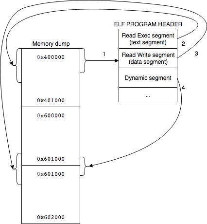

# core2ELF64

## Introduction

**core2ELF64** is an utility to **recover 64 bit ELF executables from core dumps**. It supports a wide variety of core dumps:
  * Core dumps of **Dynamically linked** binaries
  * Core dumps of **PIE** binaries 
  * Core dumps of **RELRO** enabled binaries
  * Core dumps of **Statically linked** binaries without `glibc`

This project is heavily based on [core2elf](https://bitbucket.org/renorobert/core2elf.git), a project by Reno Robert for 32 bit core dumps, which, in turn, it is based on [Silvio Cesare's white paper](https://bitbucket.org/renorobert/core2elf/src/9194ebc6d72b1c85f8f6844af85681580522d75b/core-reconstruction.txt?at=master&fileviewer=file-view-default).

core2ELF64, unlike core2elf, supports to statically linked, PIE and RELRO binary dumps.

## Compilation
To compile `core2ELF64` simply use the provided Makefile:

```
make all
```

In this way the program is compiled together with all the provided examples.

## How to use it / Example

First we need to obtain a core dump of a program. For that you can use the `gcore` utility or the provided `sample/dump.sh` script that before calling `gcore` it assures that [coredump_filter](man7.org/linux/man-pages/man5/core.5.html) is correctly set.

```
$ cd sample/hello

$ ./hello &
[1] 9143
bss_var....[0x60106c]=0x13371337
data_var...[0x601050]=0x00bef03e
stack_var..[0x7ffda80f17dc]=0xcafecafe
heap_var...[0x15fa010]=0xabcdabcd

[1]+  Stopped                 ./hello

$ sudo ../dump.sh $(pgrep hello)
Saved corefile core.9143
```

After the dump is obtained, in order to recover the binary it is sufficient to call the `core2ELF64` program by passing as first argument the core dump file and as second parameter the desired name of the output file: 

```
$ ../../core2ELF64 core.9143 rebuild

[*] Core dump contains the following segments:

Index              Type   Virt. addr. start    Virt. addr. end      Flags
[   0]             NOTE   0x0000000000000000 - 0x0000000000000000   R    
[   1]             LOAD   0x0000000000400000 - 0x0000000000401000   R   X
[   2]             LOAD   0x0000000000600000 - 0x0000000000601000   R    
[   3]             LOAD   0x0000000000601000 - 0x0000000000602000   R W  
[   4]             LOAD   0x00000000015fa000 - 0x000000000161b000   R W  
[   5]             LOAD   0x00007f6ca4380000 - 0x00007f6ca4540000   R   X
[   6]             LOAD   0x00007f6ca4540000 - 0x00007f6ca4740000   R    
[   7]             LOAD   0x00007f6ca4740000 - 0x00007f6ca4744000   R    
[   8]             LOAD   0x00007f6ca4744000 - 0x00007f6ca4746000   R W  
[   9]             LOAD   0x00007f6ca4746000 - 0x00007f6ca474a000   R W  
[  10]             LOAD   0x00007f6ca474a000 - 0x00007f6ca4770000   R   X
[  11]             LOAD   0x00007f6ca4948000 - 0x00007f6ca494b000   R W  
[  12]             LOAD   0x00007f6ca496f000 - 0x00007f6ca4970000   R    
[  13]             LOAD   0x00007f6ca4970000 - 0x00007f6ca4971000   R W  
[  14]             LOAD   0x00007f6ca4971000 - 0x00007f6ca4972000   R W  
[  15]             LOAD   0x00007ffda80d3000 - 0x00007ffda80f4000   R W  
[  16]             LOAD   0x00007ffda8180000 - 0x00007ffda8182000   R   X
[  17]             LOAD   0xffffffffff600000 - 0xffffffffff601000   R   X

[*] Valid text segments: 1 5 10 16 
[*] Text segment index = 1
[*] Reconostructed Program Header:

Index              Type   Virt. addr. start    Virt. addr. end      Flags
[   0]             PHDR   0x0000000000400040 - 0x0000000000400238   R   X
[   1]           INTERP   0x0000000000400238 - 0x0000000000400254   R    
[   2]             LOAD   0x0000000000400000 - 0x000000000040095c   R   X
[   3]             LOAD   0x0000000000600e10 - 0x0000000000601070   R W  
[   4]          DYNAMIC   0x0000000000600e28 - 0x0000000000600ff8   R W  
[   5]             NOTE   0x0000000000400254 - 0x0000000000400298   R    
[   6]     GNU_EH_FRAME   0x0000000000400834 - 0x0000000000400868   R    
[   7]        GNU_STACK   0x0000000000000000 - 0x0000000000000000   R W  
[   8]        GNU_RELRO   0x0000000000600e10 - 0x0000000000601000   R    

[*] Text segment:    0x400000 - 0x40095c
[*] Data segment:    0x600e10 - 0x601070
[*] Dynamic segment: 0x600e28 - 0x600ff8

[*] Recovered sections:
    .interp
    .dynamic
    .note
    .eh_frame
    .eh_frame_hdr
    .bss
    .init_array
    .fini_array
    .dynstr
    .dynsym
    .got.plt
    .data
    .plt
    .init
    .rela.dyn
    .rela.plt
    .text
    .fini
    .gnu.version
    .gnu_version_r
    .gnu.hash

[*] 8 GOT entries found

```

Then it is possible to check that the recovered executable correctly works:

```
$ ./rebuild 
bss_var....[0x60106c]=0x13371337
data_var...[0x601050]=0x000af7e3
stack_var..[0x7ffdfb7799ec]=0xcafecafe
heap_var...[0x20d7010]=0xabcdabcd
```

## Details

The provided solution works with the dump of these kind of binaries:

* ELF 64-bit LSB executable
* ELF 64-bit LSB shared object (PIE executables)
* Full RELRO binaries
* Statically linked binaries without libc

The steps to recover the binaries from the dump can be summarized as follow:

1. Loop over all core dump's memory segments and search for a text segment, i.e. a memory region with Read and eXecute permissions for which the first 4 bytes correspond to the ELF magic numbers. In case of multiple segments that satisfy these requirements, it is requested the user interaction to choose the correct one. 
2. From the recovered text segment it is possible to recover the ELF program/segment header. From this it is possible to recover all executable segments. 
3. All the recovered segments are written to the output file. This process is enough for statically linked program to work.
4. To help binary analysis, the sections that have a 1:1 match to the recovered segments are written in the recovered ELF. 
5. The recovered dynamic segment, if present, is analyzed to recover other sections. Thanks to these information it is possible to fix the GOT values so that they point to the correct place in the PLT.
6. Finally, the section header is written to the recovered ELF
 
In the following diagram a graphical summary is shown:



## Limitations

* As shown in the example the data segment that is rebuilt contains runtime values that may differ from the ones present at startup.

* For binaries compiled with `-static` that use `libc` are correctly rebuild but when run always cause a segmentation fault. Need some investigations to undesrtand the cause.
